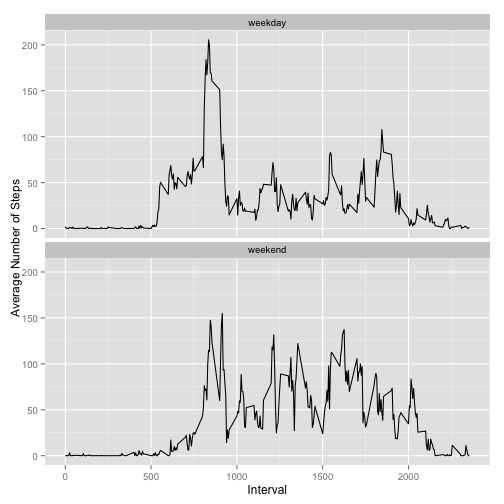

# Reproducible Research: Peer Assessment 1


## Loading and preprocessing the data
The activity data are loaded, and the date time column is added using both date and interval columns.

```r
## load data and transform the data
dat <- read.csv("activity.csv")
## make a datetime column
dat$datetime <- as.POSIXct(strptime(paste(dat$date, formatC(dat$interval, width=4, flag="0")), 
                                    "%Y-%m-%d %H%M"), "GMT")
```

## What is mean total number of steps taken per day?
First, we calculate the total number of steps taken each day. NA values are ignored by na.rm option.

```r
library(plyr)
dat.sum <- ddply(dat, .(date), summarize, total_steps=(sum(steps, na.rm=TRUE)))
```

The histogram is dipicted by the following command.

```r
hist(dat.sum$total_steps, ylab="Frequecy", xlab="the total number of steps per day",
     main="Histogram of the total number of steps taken each day")
```

 

It shows the highest between 10000 and 15000 steps per day. The mean and median can be calculated as

```r
mean(dat.sum$total_steps);median(dat.sum$total_steps)
```

```
## [1] 9354
```

```
## [1] 10395
```


## What is the average daily activity pattern?
To make a time series plot of the 5-minute interval and the average number of steps taken, we first calculate the average number of steps across all days.

```r
dat.interval <- ddply(dat, .(interval), summarize, mean_steps = mean(steps, na.rm=TRUE), 
                      med_steps = median(steps, na.rm=TRUE))
```
The plot below shows the average number of steps for each 5-minute interval. The horizontal red line shows the average across all the intervals.

```r
plot(dat.interval$mean_steps, type="l", xlab="Interval", ylab="the average number of steps across all days")
abline(h=mean(dat.interval$mean_steps, na.rm=TRUE), col=2)
```

 

The maximum number of steps looks to be taken in the morning, which can be checked by

```r
dat.interval[which.max(dat.interval$mean_steps),]
```

```
##     interval mean_steps med_steps
## 104      835      206.2        19
```

It is highest at 8:35 in the morning. This is reasonable, since a person may be going to work in the morning.

## Imputing missing values
The total number of missing values is 2304, and it can be calculated by

```r
sum(is.na(dat$steps))
```

```
## [1] 2304
```

The median steps by every interval is calculated and is filled into the missing values. The median is already defined in the previous steps, and is available in dat.interval. The data is merged with the original data set by the 5-minute interval as below.

```r
dat1 <- merge(dat, dat.interval, by="interval")
dat1$steps.imp <- ifelse(is.na(dat1$steps), dat1$med_steps, dat1$steps)
dat1 <- subset(arrange(dat1, date, interval), select=c(steps, steps.imp, date, datetime, interval))
```

The new data set, dat1, now has the original steps and the imputed steps. The total number of steps taken each day is plotted as the histogram.

```r
dat1.sum <- ddply(dat1, .(date), summarize, total_steps=sum(steps.imp))
hist(dat1.sum$total_steps, xlab="the number of steps taken each day", ylab="Frequency", main="The histogram of the total number of steps taken each day")
```

 

It looks very similar to the historam before the imputation. The mean and median are 

```r
mean(dat1.sum$total_steps)
```

```
## [1] 9504
```

```r
median(dat1.sum$total_steps)
```

```
## [1] 10395
```

The mean is slightly diffrent with no imputing, and it increases from 9354 to 9504. The median remains the same as 10395, and the imputing has no impact on the median. 

## Are there differences in activity patterns between weekdays and weekends?
We first define a variable "weekend" as follows.

```r
Sys.setlocale(category="LC_TIME", "en_US.UTF-8")
dat1$weekend <- ifelse(weekdays(as.POSIXlt(dat1$date)) %in% c("Saturday","Sunday"), "weekend","weekday")
dat1.sum.weekend <- ddply(dat1, .(weekend, interval), summarize, mean_steps=mean(steps.imp, na.rm=TRUE))
```

weekdays function returns a weekday name. The average number of steps by each interval is calculated for both weekend and weekdays.

The next plot shows how the average number of steps differs between weekdays and weekend.

```r
m <- ggplot(dat1.sum.weekend, aes(x=interval, y= mean_steps))
m <- m + geom_line() + facet_wrap(~weekend, ncol=1) 
m + xlab("Interval") + ylab("Average Number of Steps")
```

 

The graph on the top shows the average steps on weekdays, and the bottom panel shows the average on weekends. It clearly shows the difference. On weekdays, it has the peak in the morning. The number of steps drops significantly, and remains below 100 until around 18:00. On weekends, the peak in the morning is more moderate, and the level remains relatively flat throughout the day.


